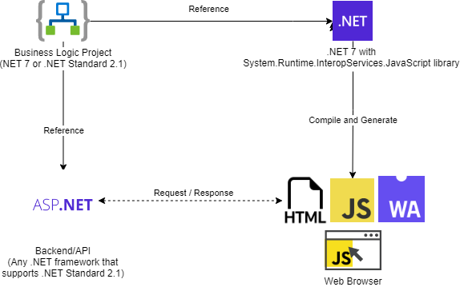

# Demonstate sharing the same C# function to JavaScript and another C# project

Imagine we are implementing Single Page Application website and need the business logic/validation apply at the client side prior to send the payload to proceed on the server side/API. If we choose NodeJS as the backend that would not be too difficult but share the same codebase for both client and server side though that is not the case for .NET in the past. The WebAssembly and System.Runtime.InteropServices.JavaScript in .NET 7 made it possible.   

## Project structure

1. A business logic project in .NET 7 or .NET Standard if aim to be using it with the older .NET version like .NET Core 3, .NET 5 or .NET 6.
2. A backend/API project in any recent .NET framework. No need to be .NET 7 if the business logic project is a .NET Standard.
3. A .NET 7 project with System.Runtime.InteropServices.JavaScript to proxy the business logic functions and compile to WebAssembly as well as producing the dotnet.js file. The dotnet.js file is used to create and start the .NET WebAssembly runtime.



## How to create .NET project with System.Runtime.InteropServices.JavaScript
Follow below steps.
1. Make sure to install .NET 7 SDK
2. Install the `wasm-experimental` workload 
    ```bash
    dotnet workload install wasm-experimental
    ```
3. Create a new project using the template that come with the `wasm-experimental` workload.
    ```bash
    dotnet new wasmbrowser
    ```

More information can be found from the official asp.net website - https://learn.microsoft.com/en-us/aspnet/core/client-side/dotnet-interop?view=aspnetcore-7.0

